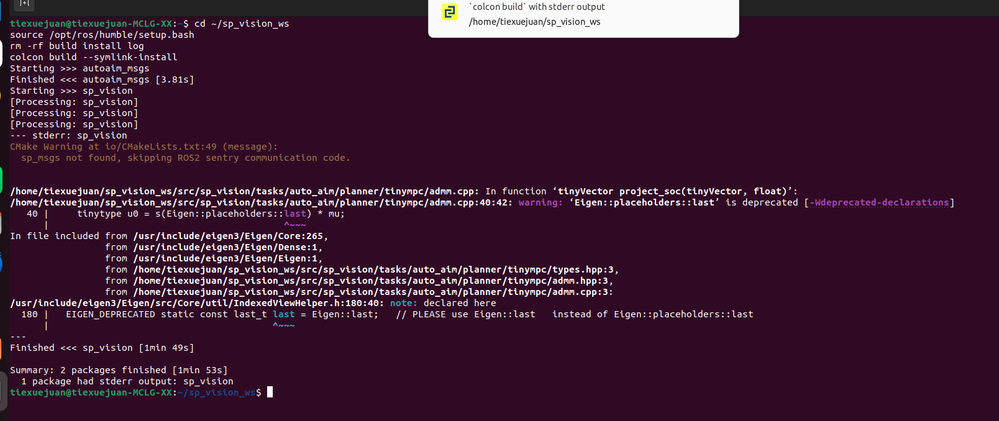
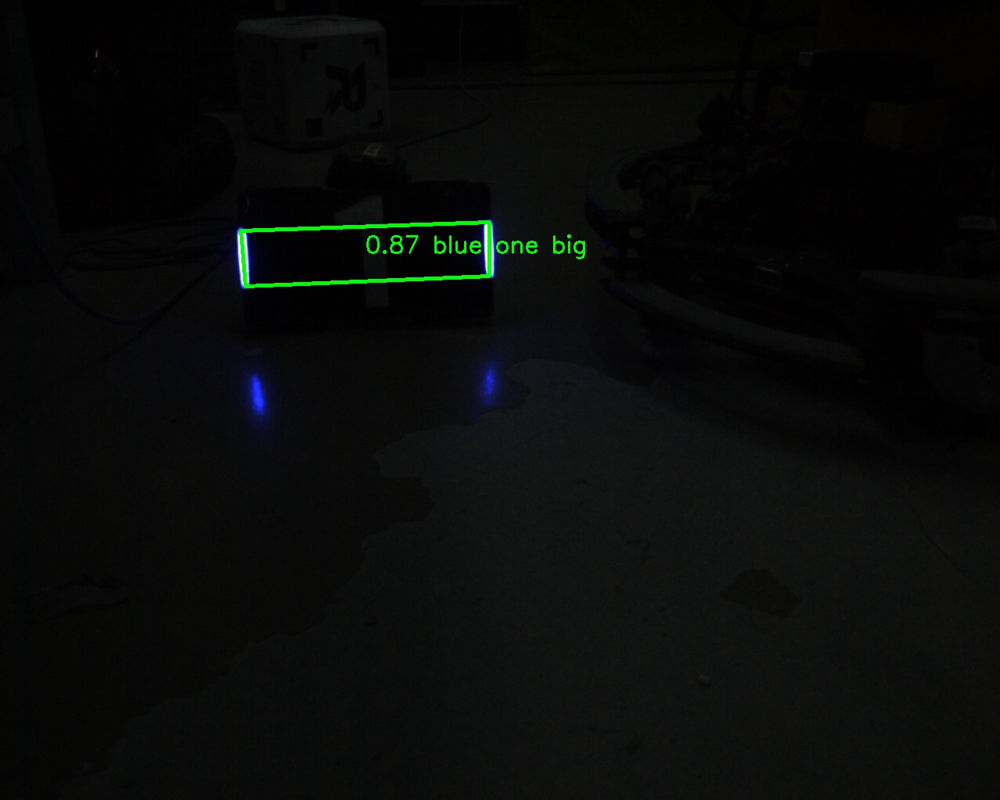
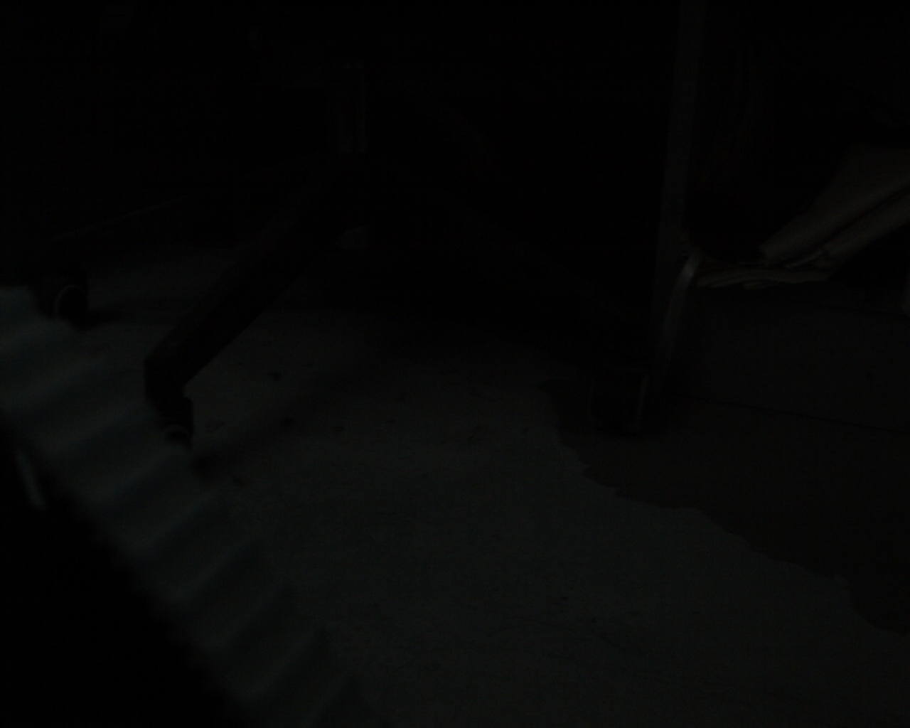
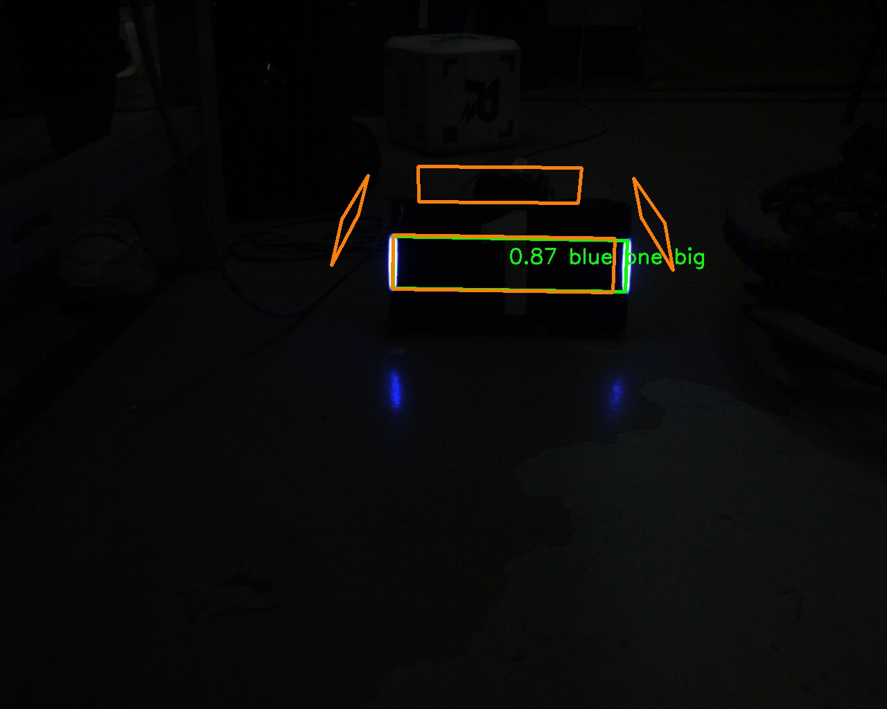
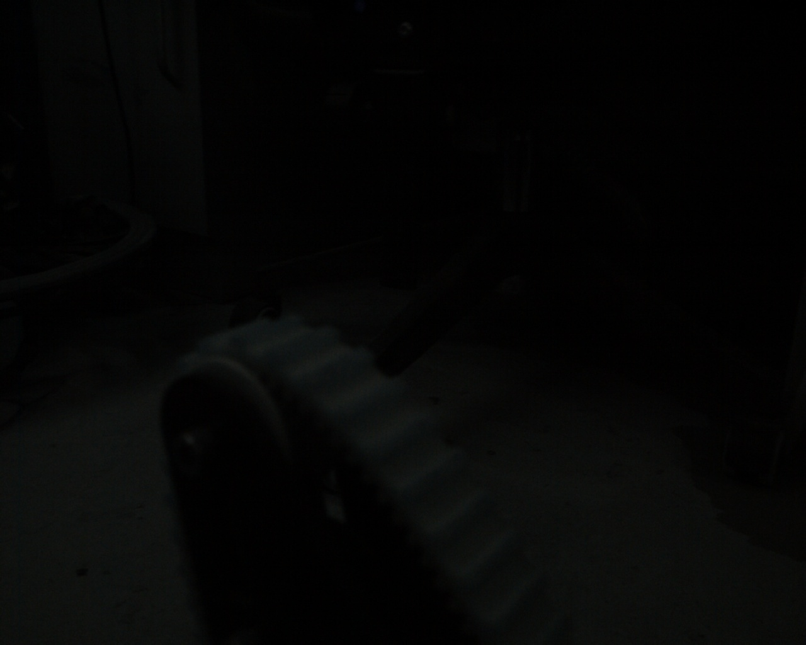
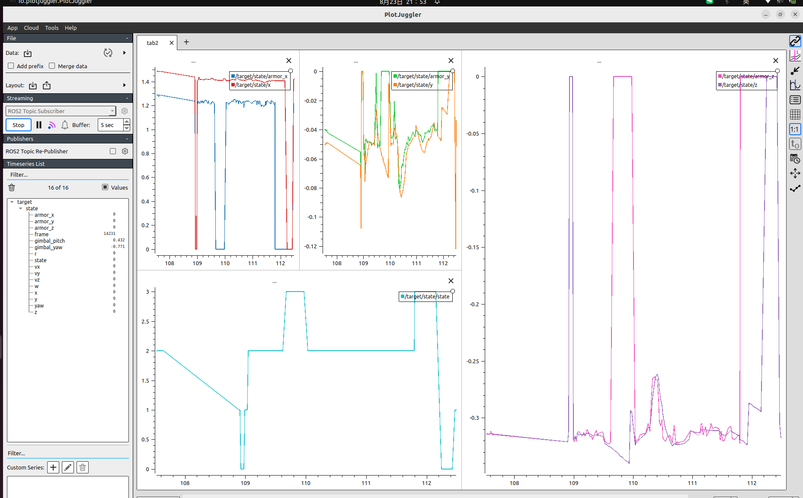

# FIX_RECORD.md — 自瞄练习开发记录

> **开始日期**: 2026-08-02

---

## 一、仓库简介

本仓库 `sp_vision_ws` 是基于 [TongjiSuperPower/sp_vision_25](https://github.com/TongjiSuperPower/sp_vision_25) 改造的 ROS2 工作区，目标是将原独立 CMake 程序改装成 ROS2 包，从 rosbag 回放数据跑通完整自瞄链路（检测 → 解算 → 跟踪），并在 PlotJuggler 中验证结果。

**目录结构**:
```
sp_vision_ws/
├── FIX_RECORD.md          # 本文件
├── shots/                 # 截图/录屏
├── src/
│   ├── sp_vision/         # 原 sp_vision_25 源码（一个 ROS2 包）
│   └── autoaim_msgs/      # 自定义消息包（已建，Orienta.msg）
├── build/                 # 自动生成，不进 git
├── install/               # 自动生成，不进 git
└── log/                   # 自动生成，不进 git
```

**分支**: `feature/tiexuejuan-ros-migration`

---

## 二、里程碑记录

## M1 — ROS 化编译 ✅ 完成

**日期**: 2026-08-02 ~ 2026-08-04

**完成了什么**:
- 创建了 `autoaim_msgs` 自定义消息包，定义 `Orienta.msg`（8 个 float32），`ros2 interface show` 验证通过
- 将 `sp_vision` 从独立 CMake 项目改造成 `ament_cmake` ROS2 包：
  - 新建 `package.xml`
  - 改造 `CMakeLists.txt`：ament_cmake 支持、install 规则
  - 适配系统 OpenCV4（`${OpenCV_LIBS}` → opencv_* target）
  - 条件编译：OpenVINO / Ceres / sentry 按依赖可用性自动开关

**怎么验证的**: `colcon build` 全量编译通过（~1分30秒），33 个可执行文件安装到位；`ros2 pkg list | grep sp_vision` 能看到两个包；`ros2 run sp_vision standard --help` 正常运行。



**修改的文件**:
- `package.xml` — 新建
- `CMakeLists.txt` — ament 改造、OpenCV4 兼容、OpenVINO 路径适配、条件编译、install 规则
- `io/CMakeLists.txt` — sp_msgs → autoaim_msgs
- `tasks/auto_aim/CMakeLists.txt` / `auto_buff/CMakeLists.txt` / `omniperception/CMakeLists.txt` — OpenVINO 路径

**遇到的主要问题**:
1. **OpenCV `${OpenCV_LIBS}` 为空**: Ubuntu 22.04 的 OpenCV4 cmake 不再设置此变量，改为手动指定 `opencv_core opencv_imgproc ...` targets
2. **pip 版 OpenVINO (ABI=0) 与系统库 (ABI=1) 不兼容**: 这是一个经典的 C++ ABI 问题。pip 安装的 OpenVINO 用旧 GCC ABI 编译，其 cmake 通过 `add_definitions(-D_GLIBCXX_USE_CXX11_ABI=0)` 全局污染所有编译单元，导致链接时与 ABI=1 的系统库（OpenCV/yaml-cpp/fmt）符号不匹配
3. **Intel APT 版 OpenVINO 解决**: 安装 `openvino-2024.6.0` 从 Intel APT 源，它用 ABI=1 编译，与系统库一致
4. **缺少 `opencv_dnn`**: 代码用到 `cv::dnn::Net` 等 DNN 模块函数，补充到 OpenCV_LIBS
5. **fmt 包自带 `--as-needed`**: 影响链接顺序，通过 `set_target_properties` 清除

**怎么排查和解决的**:
- 用 `nm -D` 对比 `.o` 文件和 `.so` 库的符号（旧 ABI 用 `Ss`/`KSs`，新 ABI 用 `__cxx11::basic_string`）
- 用 `cat -A` 查看 CMake flags.make 确认 `CXX_DEFINES` 实际值
- 追踪 OpenVINO cmake 文件中的 `add_definitions` 全局调用和 `INTERFACE_COMPILE_DEFINITIONS` target 级传播
- 最终方案：安装 Intel APT 版 OpenVINO（ABI=1），删除所有 ABI hack

**依赖安装**:
```bash
# 基础依赖
sudo apt-get install -y libopencv-dev libfmt-dev libeigen3-dev libspdlog-dev \
  libyaml-cpp-dev libusb-1.0-0-dev nlohmann-json3-dev libceres-dev

# OpenVINO (Intel APT, ABI=1)
wget -qO- https://apt.repos.intel.com/intel-gpg-keys/GPG-PUB-KEY-INTEL-SW-PRODUCTS.PUB \
  | sudo gpg --dearmor --yes -o /usr/share/keyrings/intel-sw.gpg
echo "deb [signed-by=/usr/share/keyrings/intel-sw.gpg] https://apt.repos.intel.com/openvino/2024 ubuntu22 main" \
  | sudo tee /etc/apt/sources.list.d/intel-openvino.list
sudo apt update && sudo apt install -y openvino
```

**还没解决什么**: 无，M1 目标全部达成。

---

## M2 — 回放订阅配对 ✅ 完成

**日期**: 2026-08-08 ~ 2026-08-09

**完成了什么**:
- 新建 ROS2 节点 `src/bag_replay_node.cpp`（`ros2 run sp_vision bag_replay_node`）
- 同时订阅 `/image_raw`（sensor_msgs/Image）和 `/imu/quaternion`（autoaim_msgs/Orienta），QoS 用 `SensorDataQoS` 与 bag 录制端匹配
- 按"同帧同序"规则做顺序配对：两路各自暂存一帧，一图 + 一四元数到齐即配对
- 用 `cv_bridge` 将 ROS Image 转换为 `cv::Mat`（BGR8）
- 从 Orienta 提取 `Eigen::Quaterniond` 四元数
- 从 `header.stamp.nanosec` 还原 `steady_clock::time_point`
- 独立计数 image/quat/paired 帧数，打印配对信息（时间戳、四元数、图像尺寸、帧间隔 `dt`）

**验证方法**:
```bash
# 终端1: 启动订阅节点
source install/setup.bash && ros2 run sp_vision bag_replay_node

# 终端2: 播放 bag
ros2 bag play bags/move_translate_bag --loop

# 预期输出:
# [bag_replay_node]: PAIRED [frame N] stamp=... | q=(...) | img=1280x1024 | dt=...ms
# 结束时 image 数 = quat 数 = paired 数（同帧同序）
```

**验证结果**:
- 12s 回放内完成 317 帧配对，结束统计 image = quat = paired，同帧同序无错配
- 相邻帧 `dt` 分布 16~75ms，与 bag 帧率一致
- 图像正确解码为 1280×1024 BGR8
- 四元数 `w≈0.981`，云台姿态正常（bag 场景为运动云台）

**新增的文件**:
- `src/bag_replay_node.cpp` — M2 订阅配对节点
- `LEARNING_GUIDE.md` — 学习指南（含新手教程：双终端操作、rosbag 通俗解释、输出逐字段详解、常见问题排查）

**修改的文件**:
- `CMakeLists.txt` — 添加 `bag_replay_node` 可执行文件及其 ROS2 依赖

**关键设计决策**:
- **配对方案从 message_filters 换成顺序配对**：最初计划用 `message_filters::ApproximateTime` 按时间戳同步两路消息，实测发现 `Orienta.msg` 没有 `header` 字段，message_filters 拿不到四元数消息的时间戳，无法同步。由于录制端保证同帧同序发出（任务书 §三），改为顺序配对（一图 + 一四元数即配对），实现更简单且实测无错配。
- 节点启动时不依赖 OpenVINO 或配置文件，纯数据订阅（算法部分留给 M3/M4）

**还没解决什么**: 无，M2 目标全部达成。

---

## M3 — 检测出装甲板 ✅ 完成

**日期**: 2026-08-19 ~ 2026-08-23

**完成了什么**:
- `bag_replay_node` 接入 YOLO 检测器（yolo11 模型，OpenVINO CPU 推理），每个配对帧直接送进 `detector_->detect()`
- 对检测结果做分类统计（颜色/名称/类型），节点退出时打印汇总
- 每 30 帧把检测框自绘到图像上（绿色顶点 + 中心 + 分类文字），存 `shots/m3_frameNNNN_armorsN.jpg`——这是无显示器环境下替代"可视化窗口"的验收证据
- `configs/standard3.yaml` 填入任务书 §5.1 的 6mm 档相机内参/畸变、相机→云台外参、云台→IMU 外参；`device` 由 GPU 改为 CPU

**怎么验证的**:
```bash
# 终端1: 启动节点（cwd 必须是 src/sp_vision，配置/模型路径是相对路径）
source install/setup.bash && cd src/sp_vision && ros2 run sp_vision bag_replay_node

# 终端2: 回放 bag
source install/setup.bash && ros2 bag play bags/move_translate_bag --loop
```

2026-08-23 用当前代码重跑验收，一次运行的结果：

- 配对 3564 帧（跨 3 个 bag loop），检出 2982 次
- **分类 100% 一致为 `blue/one/big`**——bag 场景是单块蓝方大装甲板，无颜色/类型闪烁，分类正确
- 帧级检出率 84%（2982/3564）；`armors=0` 的 582 帧集中在云台摆离目标的方向段，目标一进入视野就连续稳定检出（见日志 `q=(...)` 与 `armors=1` 的对应关系）
- 截图程序化验证：`armors1` 截图含约 5000 个绿色标记像素（检测框确实画上），`armors0` 截图无标记，与文件名一致





**修改的文件**:
- `src/bag_replay_node.cpp` — 接入 YOLO 检测、分类统计、截图保存
- `CMakeLists.txt` — `bag_replay_node` 增加链接 `auto_aim tools io fmt yaml-cpp`
- `configs/standard3.yaml` — 6mm 档内外参（任务书 §5.1）、`device: CPU`

**遇到的主要问题**:
1. **GPU 推理跑不通**：`device: GPU` 时 OpenVINO GPU 插件在本机不可用，初始化失败 → 改 `device: CPU` 后推理正常
2. **无显示器环境看不到检测效果**：YOLO debug 模式的 `imshow` 窗口弹不出来 → 在节点里自绘检测框并每 30 帧存一张截图到 `shots/`，作为可视化验收证据（任务书 §八 要求的 M3 检测截图即来自这里）
3. **bag 播放端忽略 `/imu/quaternion`**：play 日志报 `Ignoring a topic '/imu/quaternion', reason: package 'autoaim_msgs' not found`——播放终端只 source 了 `/opt/ros/humble`，没有 source 工作区的 `install/setup.bash`，找不到 `autoaim_msgs` 无法反序列化 → 两个终端都要 source 工作区环境（这正是任务书 §5.2 警告的场景，实测踩中）
4. **`--loop` 边界出现负 dt、计数不等**：loop 回绕时 stamp 从 ~975ms 跳回 0，`dt` 出现负值；节点在播放中途启动时 image/quat 计数也会不齐 → 顺序配对的"pending 覆盖"策略保证配对不串帧，负 dt 只出现在 loop 边界。M4 的 EKF 使用时需要注意（或改为单次播放）

**还没解决什么**:
- GPU 推理未跑通，当前为 CPU 推理；CPU 推理的实时性是否满足 M4 需求待验证
- bag 里只有一块蓝方大装甲板，其他颜色/类型的分类正确性未验证
- 无显示器环境看不到实时窗口，可视化以截图为准（真机调试可用 debug 窗口）

---

## M4 — 解算 + 跟踪 ✅ 完成

**日期**: 2026-08-23

**完成了什么**:
- `bag_replay_node` 接入 `auto_aim::Solver`（PnP 解算）和 `auto_aim::Tracker`（EKF 跟踪），复刻原项目 `standard.cpp` 的接线：每帧先 `set_R_gimbal2world(q)`（内部做 IMU 安装外参 sandwich 补偿），再 `tracker.track(armors, t)`（内部按需调 `solver.solve` 做 PnP）
- 输出世界系目标状态：旋转中心位置/速度（EKF 11 维状态 `[x,vx,y,vy,z,vz,angle,w,r,l,h]` 的前 6 维）、yaw、yaw 角速度、旋转半径
- 日志每帧追加 `state` 和 `pos/vel/yaw/w/r` 字段；每 30 帧截图把跟踪目标**重投影**回像素画上（橙色），与检测框（绿色）对比，验证解算正确性
- `configs/standard3.yaml` 的 `enemy_color` 由 red 改为 blue（bag 场景是蓝方装甲板）

**怎么验证的**:

单次播放（不加 `--loop`）一次运行配对 646 帧：

- **状态机与配置严格吻合**：detecting 连续 5 帧命中（`min_detect_count=5`）转 tracking；目标出视野后 temp_lost 满 15 帧（`max_temp_lost_count=15`）转 lost；再检出后重新 detecting→tracking。状态分布：tracking 433 / detecting 89 / temp_lost 68 / lost 56
- **世界系位置合理且稳定**：目标静止场景下 `pos≈(1.46, -0.05, -0.31)`，速度≈0，稳定段波动 ±0.03m，无系统性漂移
- **截图验证**：跟踪帧截图中橙色重投影（只画与检测平均像素距离最近的那块板，整车 4 块板全投影太乱）**100% 像素落在检测框内**，可见板重投影与检测框重合

```text
PAIRED [frame 645] ... armors=1 | state=tracking | pos=(1.48,-0.05,-0.31) vel=(-0.01,0.00,0.00) | yaw=-0.04 w=-0.05 r=0.19
```





**修改的文件**:
- `src/bag_replay_node.cpp` — 构造 Solver+Tracker、每帧解算跟踪、日志扩展、重投影截图
- `configs/standard3.yaml` — `enemy_color` 改 blue

**遇到的主要问题**:
1. **enemy_color 配错会静默无目标**：原配置是 red，tracker 按颜色过滤会丢掉 bag 里全部蓝方装甲板，永远不出目标。排查：M3 分类统计 100% `blue/one/big` → 确认场景是蓝方 → 改 `enemy_color: "blue"`
2. **跟踪中位置出现单次跳变**：第 203~210 帧 px 从 1.70m 跳到 1.11m，约 10 帧后收敛回 1.4m 附近，伴随 y 从 -0.02 摆到 -0.21——发生在云台扫过目标换板时（EKF 重新匹配装甲板 id），属瞬态而非发散。留到 M5 用曲线进一步观察
3. **处理速度跟不上回放**：CPU 推理约 31~34fps < bag 的 46.5fps，reliable QoS 下播放器会等待，单次播放只消费 646/1247 帧（dt 拉大到 50~117ms）。对 tracker 无实质影响（个别 dt>0.1s 的帧会触发一次重置但立即恢复 detecting），如实记录
4. **tracker 选目标的图像中心硬编码 1440×1080**（tracker.cpp 原项目遗留），bag 是 1280×1024：单目标场景无影响，多目标时选板会偏向画面一侧，本次不修改

**还没解决什么**:
- 换板瞬态跳变（问题 2）未根治，M5 用 PlotJuggler 曲线观察其频率与幅度
- 图像中心硬编码（问题 4）多目标场景需要改
- 处理速度瓶颈（CPU 推理）导致回放掉帧，M5 可能需要 `--rate` 放慢或继续尝试 GPU

---

## M5 — PlotJuggler 曲线 ✅ 完成

**日期**: 2026-08-23

**完成了什么**:
- `autoaim_msgs` 新增 `TargetState.msg`（16 字段：目标旋转中心位置/速度/yaw/角速度/半径、**可见装甲板位置 armor_x/y/z**、状态、帧号、云台姿态对照量）
- `bag_replay_node` 每个配对帧发布一次 `/target/state` 话题（无目标时也发，保证 state 曲线连续）；armor 位置取 track 后优先级最高的装甲板的 `xyz_in_world`（PnP 直测值）
- 安装 PlotJuggler（`ros-humble-plotjuggler-ros`），实时订阅 `/target/state` 画曲线：target x/y/z 与 armor x/y/z 同图对照 + state 阶梯线

**怎么验证的**:

1. **数值验收**（`ros2 topic echo /target/state` 落盘 605 条，tracking 段 433 帧，python 回归分析）：
   - x/y/z 线性回归斜率 **0.12 / -0.12 / 0.02 mm/帧**——相对 1.35m 距离与 ±0.1m 换板振荡可忽略 → **无系统性漂移**
   - z 轴 σ=12mm（高度极稳）→ 6mm 内外参 + 坐标变换 + 时间戳对齐正确
   - tracking 期间 gimbal_yaw 扫过 -0.44~0.17 rad（约 35°）——**运动云台下世界系目标不漂移**，正是任务书验收点
   - 12 次 >0.1m 跳变全部对应换板/重新入视瞬态（M4 已记录），相邻帧间无毛刺
2. **视觉验收**：PlotJuggler **双曲线对照**——target（EKF 旋转中心，平滑稳定）与 armor（PnP 直测可见板位置，随换板围绕 target 摆动 ±旋转半径 0.2m），一静一动的对比直观展示 EKF 的平滑作用；检测窗口 + 曲线同屏录屏 20s（见下）



**录屏证据**：`shots/m5_recording.webm`（20s，识别画面 + PlotJuggler 曲线同屏滚动）

**修改的文件**:
- `src/autoaim_msgs/msg/TargetState.msg` — 新建
- `src/autoaim_msgs/CMakeLists.txt` — 追加生成 TargetState.msg
- `src/sp_vision/src/bag_replay_node.cpp` — 发布 /target/state

**遇到的主要问题**:
1. **PlotJuggler 启动即崩溃**：崩溃栈显示 Qt5 库加载自 `/opt/MVS/bin`——海康相机 SDK 把自带 Qt 塞进了 `LD_LIBRARY_PATH`（~/.bashrc），PlotJuggler 捡到这套没有 xcb 平台插件的 Qt 后 abort。解决：启动前把 `LD_LIBRARY_PATH` 里的 `/opt/MVS` 路径过滤掉，用系统 Qt 启动
2. **PlotJuggler 插件报 `package 'autoaim_msgs' not found`**：启动 PlotJuggler 的终端没 source 工作区 `install/setup.bash`，和 M2 踩的是同一个坑（这次踩在 plotjuggler-ros 插件上）。解决：先 `source ~/sp_vision_ws/install/setup.bash` 再启动
3. **新手 GUI 上手困难**：话题列表是点击订阅按钮时的一次性快照，节点没起时列表为空；字段在左侧树里，需要拖拽到图区。已把正确操作顺序固化到"项目说明"的运行方式里

**还没解决什么**:
- 换板瞬态在曲线上表现为周期性小尖峰（M4 遗留问题），幅度约 0.1~0.6m，不影响跟踪稳定性
- `--loop` 播放时 PlotJuggler 曲线会无限累积，观看时需手动清空（工具栏 Clear 按钮）
- GNOME 自带录屏画质一般，正式答辩如需更高质量可用 OBS 重录

---

## M6 — 摆臂实车部署 + ITL 通讯协议迁移（进行中，代码侧完成）

**日期**: 2026-09-09

**完成了什么**:
- **协议迁移**：`io::Gimbal` 从 sp25 原生 `'S','P'`+CRC16 协议改为 ITL `'V','G'`/`'G','V'` 协议（28B/42B 定长帧、无 CRC 仅头尾字节校验、115200 波特率 + 50ms 超时、逐字节扫描重同步、读错误 >100 重连、`q_calib` 安装角校准）。帧规格逐字节对照电控固件（RM-ITL/Auto_aim 派生自 sp_vision_25，字段布局完全一致，仅帧头/校验/波特率/校准四处差异）
- **standard_mpc 对齐 ITL 行为**：无目标/IDLE 帧回显当前反馈角（原为发零，避免 mode 切换阶跃）；新增开火门控（指令角 vs 电控反馈角，近 <2m 1.8°/远 1.3°，`auto_fire: false` 可退回纯 planner.fire）
- **相机驱动**：hikrobot 定分辨率 1280×1024 + 可配置 fps（原为 1440×1080 原生 + 150fps 硬编码，与 1280×1024 标定内参不匹配必毁 PnP）；mindvision 固定 1280×1024（自定义 ROI，失败回退最大分辨率）；camera 工厂读可选键 `image_width/image_height/frame_rate`
- 新建 `configs/arm_deploy.yaml`（海康/迈德威视两行切换、`baudrate`/`q_calib`/开火容差；内外参为 standard3 占位值，实车标定后替换）
- 新建 `tests/gimbal_frame_test.cpp`（22 项字节布局断言）、`scripts/mcu_emulator.py`（MCU 仿真器：pty/TCP 双模式、IDLE 回显断言、垃圾注入重同步测试、bullet_count 模拟）
- 新建 `calibration/capture_gimbal.cpp`（串口协议版标定采集，输出格式与 capture.cpp 一致）
- 新建 `watchdog.sh`（进程守护重启）、重写 `autostart.sh`（原版路径写死 `~/Desktop/sp_vision_25/`，改为按脚本位置推导）

**怎么验证的**:
- `gimbal_frame_test` **22/22 ALL PASS**（28/42 字节精确、头尾、逐字段偏移、小端 float/u16）
- 仿真器帧编解码往返验证通过（42B 反馈帧 / 28B 指令帧定长、头尾、float32 字段与 C++ 断言同值交叉一致）
- `colcon build` 全量通过，`gimbal_frame_test`/`capture_gimbal`/`standard_mpc` 全部安装到位
- **环境限制（如实记录）**：Claude Code 执行环境对嵌套 pty 只放行首帧（master 写之后永久阻塞），C++↔仿真器实时回路无法在本机跑通；真机验证命令见下

**修改的文件**: `io/gimbal/gimbal.{hpp,cpp}`、`src/standard_mpc.cpp`、`io/hikrobot/hikrobot.{hpp,cpp}`、`io/mindvision/mindvision.{hpp,cpp}`、`io/camera.cpp`、`CMakeLists.txt`
**新增的文件**: `configs/arm_deploy.yaml`、`tests/gimbal_frame_test.cpp`、`scripts/mcu_emulator.py`、`calibration/capture_gimbal.cpp`、`watchdog.sh`、`autostart.sh`（重写）

**遇到的主要问题**:
1. 捆绑 serial 库（wjwwood 旧版）`setTimeout` 参数要左值引用 → 先具名变量再传入
2. 嵌套 pty 在本开发环境被卡死（首帧后 master 写阻塞，单进程内 pty 正常）→ 仿真器加 `--tcp` 模式 + socat 桥方案绕过，真机仍需按正常 pty 流程验证
3. 仿真器首版在视觉端未打开串口时 `os.write` OSError 直接退出发送线程 → 改为重试等待
4. `os.write` 不接收 socket 对象 → TCP 模式用 `fileno()` 归一化为 fd
5. hikrobot.cpp 新增 `int ret` 与函数内已有 `unsigned int ret` 冲突 → 改名 `ret_wh`

**还没解决什么 / 实车待办**:
- C++↔仿真器实时回路真机验证（命令见下）；摆臂实车标定（内参/手眼/`R_gimbal2imubody` 校核/`q_calib`）；`arm_deploy.yaml` 内外参替换为实车标定值；相机型号与镜头档确认；实车验收按《摆臂部署与协议迁移计划.md》阶段 F 分步执行

真机端到端验证命令：
```bash
# T1: MCU 仿真器（真机 pty 正常，直接 pty 模式；输出 /dev/pts/N）
python3 src/sp_vision/scripts/mcu_emulator.py --inject-garbage 200
# T2: 把 /dev/pts/N 填进 /tmp/test_gimbal.yaml 的 com_port（baudrate: 115200）
ros2 run sp_vision gimbal_test -f /tmp/test_gimbal.yaml
# 预期：仿真器 fail=0、echo_fail=0、rx>0（收到指令帧）、resync_injections>0 无断连
```

### 实车验证（2026-09-11，摆臂）

- **硬件**：海康 MV-CA013-21UC（2bdf:0001，原生 1280×1024）+ 下位机 STM32 虚拟串口（0483:5740，udev 软链 `/dev/gimbal` + 0666；注意 `udevadm trigger` 默认 change 事件不生效，需 `--action=add` 或拔插）
- **串口**：`gimbal_test` `First q received`，15s 零错误零重连 —— **ITL 协议与电控固件真机联通**
- **相机**：`camera_test` 150fps 稳定；gain 16.9 超出 MV-CA013 范围（`0x80000102`）改 12
- **检测**：`standard_mpc` + `force_mode: "auto_aim"`（摆臂下位机恒发 mode=0，无档位切换）实时检测蓝色装甲板稳定；每秒检测状态日志 `[AutoAim] armors=...`
- **可视化修复**：YOLO 检测窗口只闪第一帧不刷新 —— 主循环缺 `cv::waitKey(1)` 泵送 GUI 事件，已补
- **工作区踩坑**：colcon 曾在 src/sp_vision 内误跑产生嵌套 build/install（已清理）；对内仓库 Auto_aim/ 与 autoaim_msgs 同名包冲突 → COLCON_IGNORE + .gitignore
- **待办**：符号约定验证（发现下位机 `yaw_vel==pitch_vel` 恒等、只上下转时 yaw 同步变化，待与电控确认固件语义）；标定（内参/手眼/q_calib）；systemd 自启（参考对内仓库 scripts/auto_aim.service）

### 实车验证（2026-09-12）

- **符号约定结案**：确认摆臂为**两轴机械联动**（一起转动）——yaw/pitch 同步变化、`yaw_vel==pitch_vel` 均为联动机制所致，固件正常，无需改动
- **标定值采用队内配置**：`arm_deploy.yaml` 填入对内仓库 `Auto_aim/src/config/standard3.yaml`「老步兵——摆臂」的整套标定（6mm 档内参 fx=1330.65/fy=1332.30/cx=627.28/cy=533.28、相机→云台外参标准变换阵 + t=[0.1519,0.0756,0.0222]、tracker 参数、曝光 3.0ms）；`[AutoAim]` 状态日志增加世界系 pos 输出
- **验证通过**：检测+跟踪状态正常，目标世界系位置与实际距离吻合（队内标定值适配摆臂相机）

---

## 三、项目说明

（按任务书 §4.3，做到 M3 后开始稳定维护）

**项目功能**: 从 rosbag 回放订阅 `/image_raw` + `/imu/quaternion`，同帧同序配对后送 YOLO 检测装甲板，经 PnP 解算 + EKF 跟踪输出世界系目标位置/速度/姿态，发布 `/target/state` 话题供 PlotJuggler 实时画曲线，并定期保存检测与重投影截图。**M1~M5 五个里程碑全部跑通。** 实车入口（M6）：`ros2 run sp_vision standard_mpc configs/arm_deploy.yaml`，经 ITL 串口协议（28B/42B 帧）与电控下位机通信，支持海康/迈德威视相机切换，watchdog.sh 守护重启。

**运行方式**（三终端）:
```bash
# T1 节点（cwd 必须是 src/sp_vision，配置/模型是相对路径）
cd src/sp_vision && source ../../install/setup.bash && ros2 run sp_vision bag_replay_node
# T2 回放（两个终端都要 source 工作区，否则报 autoaim_msgs not found）
source install/setup.bash && ros2 bag play bags/move_translate_bag [--loop]
# T3 曲线（注意过滤海康 MVS 的 LD_LIBRARY_PATH 污染，否则 Qt 崩溃）
source install/setup.bash && export LD_LIBRARY_PATH=$(printf '%s' "$LD_LIBRARY_PATH" | tr ':' '\n' | grep -v '/opt/MVS' | paste -sd: -) && ros2 run plotjuggler plotjuggler
```
PlotJuggler 操作顺序：**先起 T1/T2 再点 ROS2 Topic Subscriber**（话题列表是点击时的快照）→ 勾选 `/target/state` → 左侧树把 x/y/z 拖进图区（右键图区 Split horizontally 可给 state 单开一行）。

**依赖**: Ubuntu 22.04 + ROS2 Humble；系统库 `libopencv-dev libfmt-dev libeigen3-dev libspdlog-dev libyaml-cpp-dev libusb-1.0-0-dev nlohmann-json3-dev libceres-dev`；OpenVINO（Intel APT 版，ABI=1）；ROS 包 `rclcpp sensor_msgs cv_bridge autoaim_msgs`。

**输入源**: `bags/move_translate_bag`（运动云台 + 静止目标场景）。两个话题：`/image_raw`（sensor_msgs/Image，1280×1024 BGR8）和 `/imu/quaternion`（autoaim_msgs/Orienta），同帧同序、reliable QoS，每循环 1247 帧。

**输出话题或结果**: 话题 `/target/state`（autoaim_msgs/msg/TargetState：世界系位置/速度/yaw/角速度/半径/状态/帧号/云台姿态，PlotJuggler 直接订阅画曲线）；终端输出每条配对信息（`PAIRED [frame N] stamp/q/img/dt/armors/state/pos/vel/yaw/w/r`）和退出时的分类统计；检测 + 重投影截图存 `shots/`。

**参数入口**: `configs/standard3.yaml`（模型路径、`device`、`min_confidence`、`use_traditional`、6mm 相机内外参、相机参数等）；运行时 `ros2 run sp_vision bag_replay_node <config_path>`，默认 `configs/standard3.yaml`。

**当前已知局限**: CPU 推理（~31~34fps，跟不上 46.5fps 回放会掉帧）；无显示器环境无实时可视化窗口；`--loop` 边界有负 dt；节点中途启动时计数不等但配对正确；仅验证过单一蓝方大装甲板场景；换板瞬态位置跳变；tracker 选目标图像中心硬编码 1440×1080。

---

## 四、交付清单自查（任务书 §八）

1. **完整代码** ✅ — sp_vision（ROS2 化 + bag 回放节点，检测/解算/跟踪/发布全链路）+ 自建 autoaim_msgs（Orienta + TargetState）；6mm 档内外参已填入 `configs/standard3.yaml`（任务书 §5.1 数值）
2. **跑通证据** ✅（均存 `shots/` 并在上文引用）
   - colcon build 成功截图：`shots/colcon_build.png`（M1 节）
   - M3 检测框截图：`shots/m3_frame*.jpg`（118 张，示例见 M3 节）
   - M5 PlotJuggler 曲线截图：`shots/plotjuggler_curves.png`
   - 10~30s 录屏（识别画面 + 曲线同屏）：`shots/m5_recording.webm`（20s）
3. **FIX_RECORD.md** ✅ — 按 §4.3 固定结构：仓库简介 / `## M1`~`## M5` 里程碑（每块含完成了什么、怎么验证、修改了什么、遇到的问题、怎么排查解决、还没解决什么）/ 项目说明

---

